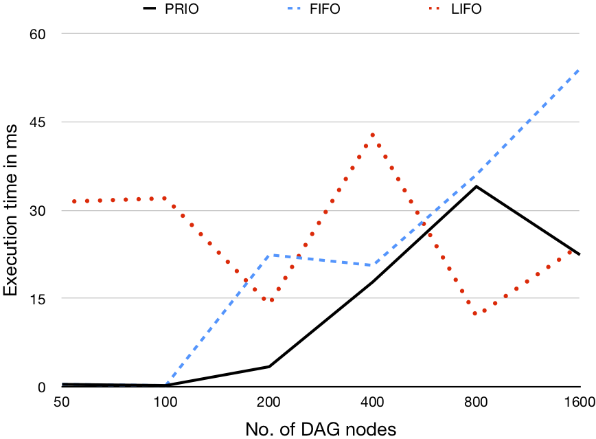
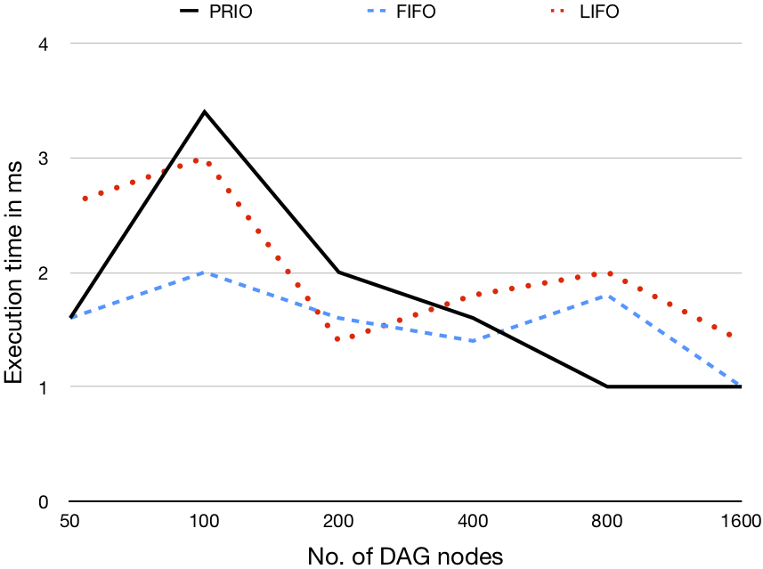
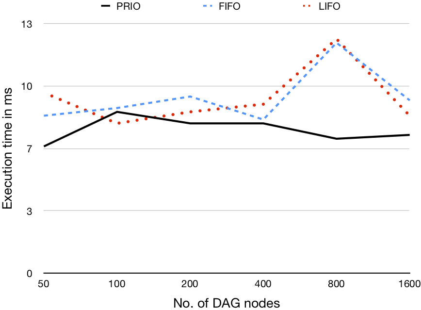
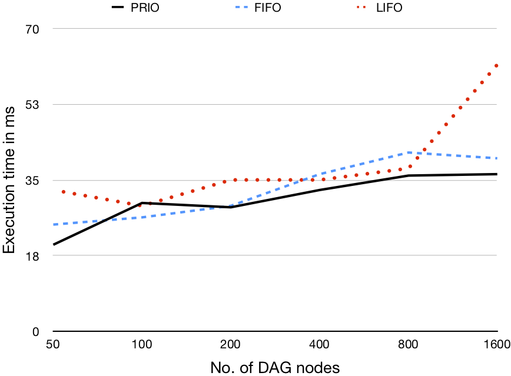
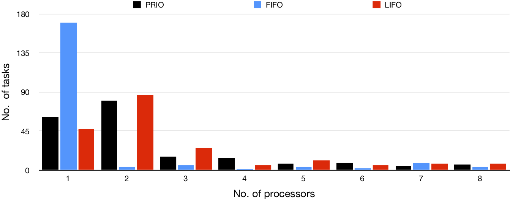
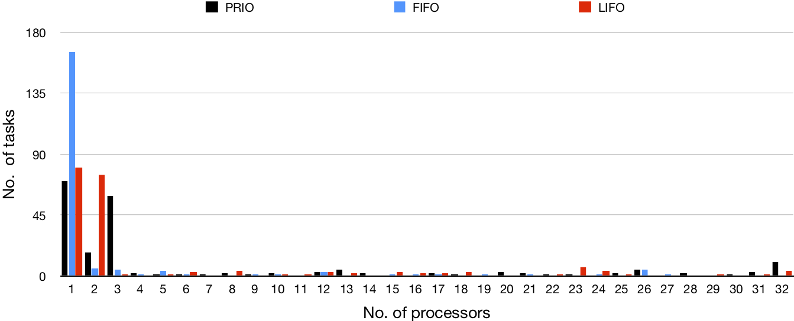

# Evaluation of Work Stealing Algorithms

We evaluate three work stealing algorithms. The classic algorithms, as well as an alternative proposal using priorities:

# Experiment Design

Each validation scenario uses a different computation size (i.e., number of tasks), generating DAGs to represent the computation containing 50, 100, 200, 400, 800, and 1600 nodes. Additionally, for each DAG size we evaluate three different graph density values (i.e., the ratio of outgoing edges to nodes) 0.2, 0.5, and 0.8

# Experiment Results

## Performance evaluation

  Density | 1 processor | 8 processos | 32 processors | 96 processors 
 -------------- | -------------- | -------------- | -------------- | -------------- 
 0.2  |  |  |  | 
 0.5  |  |  |  | 
 0.8  |  |  |  | 

## Load evaluation

### Desnsity = 0.2

No. of  Nodes | 1 processor | 8 processos | 32 processors | 96 processors
 :-------------- | :-------------- | :-------------- | :-------------- | :--------------  
 50 |  |  |  |  
200 |  |  |  |

### Desnsity = 0.5

No. of  Nodes | 1 processor | 8 processos | 32 processors | 96 processors
 -------------- | -------------- | -------------- | -------------- | --------------  
 50 |  |  |  |  
 200 |  |  |  |  

### Desnsity = 0.8

No. of  Nodes | 1 processor | 8 processos | 32 processors | 96 processors
 -------------- | -------------- | -------------- | -------------- | --------------  
 50 |  |  |  |  
 200 |  |  |  |  

# Evaluation Configuration

All our benchmarks ran on a XeonSP G291-281 GPU Server with two RTX2080 CPUs, each with 48 physical cores with a 2.2GHz frequency and a 128GB NUMA enabled memory architecture, running the Ubuntu 20.04.2 LTS OS. We use version 1.8 of the JVM for our experiments.

